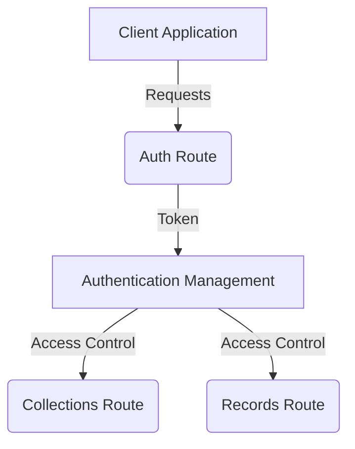
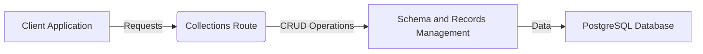
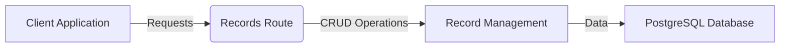
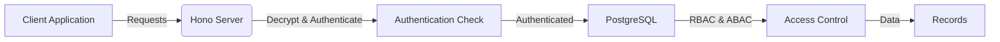

# Backend as a Service System

## Overview

This project is a backend as a service system inspired by the concept of PocketBase, a single binary backend as a service application. It features record management, collection management, authentication, and more in the future. It uses PostgreSQL as a database, Deno 2.0 runtime (TypeScript) as the server, and SolidJS for the admin management frontend.

## Features

- **Record Management**: Allow access to collections through HTTP verbs.
- **Collection Management**: Allow management of collections (schema and tables).
- **Authentication Management**: Supports email and password authentication. Future plans include adding more authentication methods like GitHub OAuth2, Google, etc.
- **Monitoring Logs and Health Checks**: Monitor logs and perform health checks.

## Roadmap

| Feature | Status |
|---|---|
| Record Management | [ ] Not Complete |
| Collection Management | [ ] Not Complete |
| Authentication | [ ] Not Complete |
| Monitoring | [ ] Not Complete |
| Admin Dashboard | [ ] Not Complete |

## Tech Stack

| Technology | Advantages |
|---|---|
| **Deno 2.0** | - Higher performance compared to Node.js - Secure dependencies with no micro-libraries - Built-in TypeScript support |
| **SolidJS** | - Faster than React, no virtual DOM - Efficient updates and rendering - Easy to learn and use |
| **Solid-UI** | - Comprehensive and easy to integrate - Ensures a consistent look and feel - Highly customizable components |
| **PostgreSQL** | - Robust and reliable - Supports complex queries and indexing - Handles large volumes of data |

## Design and Architecture

The system will have three main routes: `auth`, `collections`, and `records`.

### Auth Route

This route is for authentication management where users can get a token to access both collection and records.

### Collections Route

This route is for the management of schemas and records. Admins can perform CRUD operations on this endpoint.

### Records Route

This route is for record management and access. Client applications can perform CRUD operations on this route. Unlike the `auth` and `collections` routes that only have static paths, the `records` path is dynamic with two path parameters (`schema` and `table`). Example: `/records/:schema/:table | view | function`. Client applications can hit this endpoint if they have the privilege to do so as defined in the auth schema.

### Security

The security access for record management will be handled by both PostgreSQL and the Hono server.

- **Hono Server**: Handles HTTP authentication for the request. Its job is to decrypt and check if the request is authenticated or not.
- **PostgreSQL**: Handles row-level security with the concept of RBAC (Role-Based Access Control) and ABAC (Attribute-Based Access Control) for accessing the collections and records inside PostgreSQL itself.

## Contributing

We welcome contributions from the community. Please follow these steps to contribute:

1. Fork the repository.
2. Create a new branch (`git checkout -b feature-branch`).
3. Make your changes and commit them (`git commit -m 'Add new feature'`).
4. Push to the branch (`git push origin feature-branch`).
5. Create a pull request.

## License

This project is licensed under the MIT License. See the LICENSE file for details.